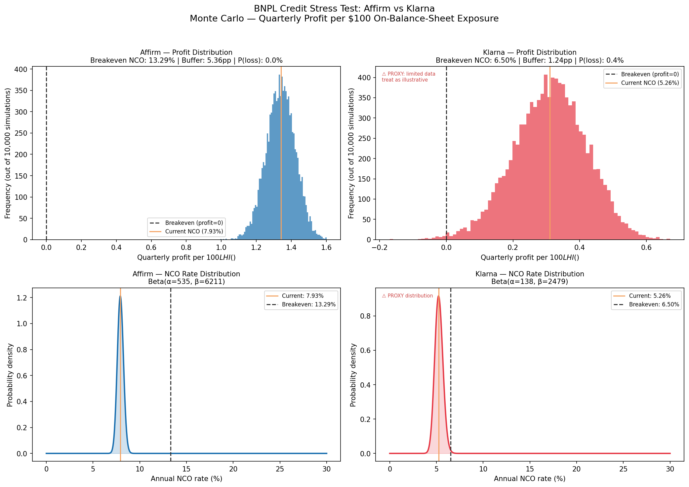

# BNPL Credit Stress Test: Affirm vs Klarna

**Question:** As BNPL "pay late" rates climb, at what point does each company's profitability actually break — and which one is more fragile?

## The real-world hook

47% of BNPL users self-reported paying late in the past year (C+R Research, 2024). Yet Affirm's 30+ day delinquency rate has stayed flat at 2.8% year-over-year. Is "paying late" converting to real charge-offs, or is it noise? This model takes a quantified position: the two companies have structurally different buffers, and the same delinquency shock would break Klarna before Affirm — by a factor of ~4×.

## Pre-flight findings

**Confirmed vs Affirm FQ3 FY2026 (quarter ended March 31, 2026):**
Revenue $1,038.8M ✓ | GMV $11.6B ✓ | Operating income $88.4M ✓ | 30+ DPD 2.8% ✓ | Allowance $512.3M = 6.0% of LHI ✓

**Key correction — Klarna product mix:** CLAUDE.md stated "75–79% Pay-in-4." Corrected: 79% is the full Pay Later umbrella (three short-term products). Pay-in-4 alone is ~26% of GMV. More importantly: only ~12% of Klarna's GMV is Fair Financing (interest-bearing, retained on balance sheet). The other 88% generates merchant fees only, with receivables sold after origination.

**Scope decision:** Both companies are stressed on their *retained* on-balance-sheet exposure:
- Affirm: $8.6B gross LHI (loans held for investment)
- Klarna: $15.2B Fair Financing outstanding (20-F, Dec 31, 2025)

This choice matters because Affirm sells a meaningful share of originated loans off-balance-sheet (gain on sales $127M in FQ3'26); stressing total GMV would misrepresent where Affirm actually carries credit risk.

**Income scope note (Affirm):** The pre-provision income figure uses total company GAAP operating income, which includes gain on loan sales ($127.2M/quarter) and servicing income ($44.6M/quarter) from loans sold off-balance-sheet. The model tests whether Affirm as a whole remains profitable under rising NCO rates — not whether the LHI book is self-funding in isolation. The LHI-standalone breakeven would be lower. This choice is consistent with Affirm's integrated capital-light model, where off-balance-sheet origination revenue is structurally linked to the same credit quality that drives LHI losses.

**Klarna data thinness:** Klarna IPO'd September 2025. Only one estimated NCO data point exists for the Fair Financing book. The Beta distribution for Klarna uses Affirm's historical coefficient of variation as an explicit proxy (2× wider to reflect data uncertainty). All Klarna outputs are illustrative of direction, not precise magnitude.

## Method

Starting from each company's reported GAAP operating income and provision for credit losses, I compute a *pre-provision income per $100 of on-balance-sheet exposure* — the income available to absorb credit losses before the company becomes unprofitable. I fit a Beta distribution to historical quarterly net charge-off rates (7 quarters for Affirm, derived from allowance roll-forward; proxy for Klarna). The Monte Carlo draws 10,000 scenarios from each distribution, computes quarterly profit per $100 LHI under each, and produces the full distribution of outcomes. The breakeven NCO rate is derived analytically as the point where pre-provision income exactly covers credit losses.

## Results

| Metric | Affirm | Klarna |
|--------|--------|--------|
| On-balance-sheet exposure | $8.6B (LHI) | $15.2B (Fair Financing) |
| Current annual NCO rate (est.) | 7.93% | 5.26% (ESTIMATED) |
| Breakeven annual NCO rate | ~13.3% | ~6.5% |
| Buffer before loss | ~5.4 pp | ~1.2 pp |
| Fragility ratio | — | Klarna ~4.3× more fragile |
| P(loss) at historical NCO distribution | <1% | moderate (proxy) |



## So what?

**Affirm** would need its annual net charge-off rate to rise from ~7.9% to ~13.3% — roughly a 67% increase — before reporting a loss. Its 71% interest-bearing product mix generates $532M/quarter in finance-charge revenue that acts as a deep buffer against rising delinquencies. The 47% "paying late" industry statistic has not, so far, translated into the NCO trajectory that would threaten Affirm's model.

**Klarna** is in a structurally thinner position. Its Fair Financing book — the only part with retained credit risk — needs only a ~1.2 percentage-point increase in NCO rate to consume Klarna's entire adjusted operating profit. The rest of Klarna's business (Pay Later) generates merchant fees without retained credit risk, but those fees don't buffer Fair Financing losses. The same delinquency shock hits a much smaller income base.

**Bottom line:** Both companies are currently profitable and not at immediate breakeven risk. But Klarna's margin of safety is ~4× thinner. A moderate credit cycle deterioration — not an extreme scenario — could flip Klarna's Fair Financing book into a loss. Affirm would need a more severe, sustained deterioration to reach the same outcome.

## What this model does not capture

1. **Funding cost shocks:** Klarna funds the FF book via consumer deposits (~$13B). Rising rates or deposit outflows would increase funding costs — not modeled here.
2. **Recession scenario:** NCO rates could jump discontinuously (not from the historical Beta distribution). The MC only reflects historical NCO variance, not macro tail events.
3. **Regulatory changes:** CFPB proposals to apply credit-bureau reporting to BNPL could change delinquency incentives for borrowers.
4. **Growth dilution:** Rapid new originations "dilute" the delinquency ratio in the short term (new loans are current). Sustained growth can mask rising credit costs.
5. **Correlation:** A macro shock would hit both companies simultaneously — the comparison assumes independent credit curves.

## Running the model

```bash
pip install -r requirements.txt
python src/run.py
```

## Data sources

- Affirm FQ3 FY2026 8-K shareholder letter (filed May 7, 2026)
- Affirm FQ3 FY2026 10-Q (Accession 0001628280-26-032294)
- StockAnalysis.com quarterly financials (provision, LHI — cross-checked vs 10-Q)
- Klarna Q4 2025 earnings release (February 19, 2026)
- Klarna 20-F FY2025 (SEC EDGAR)
- Klarna F-1 prospectus (SEC EDGAR, March 2025)
