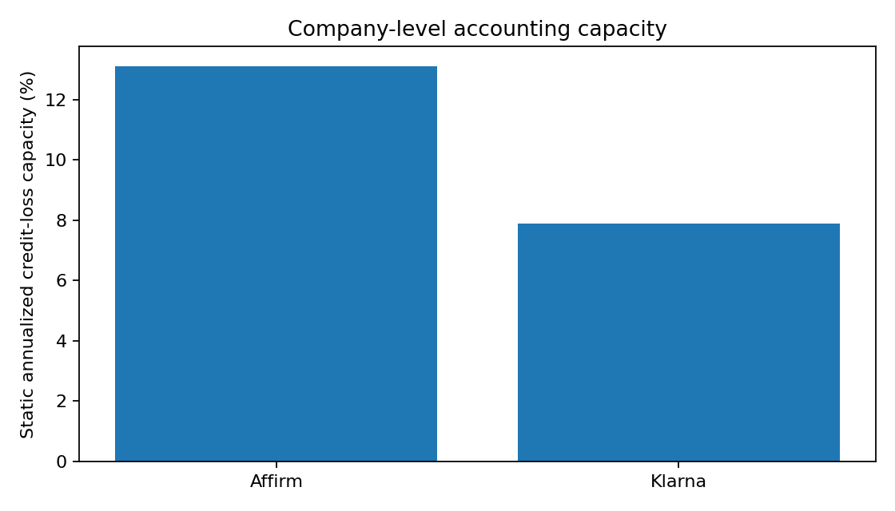
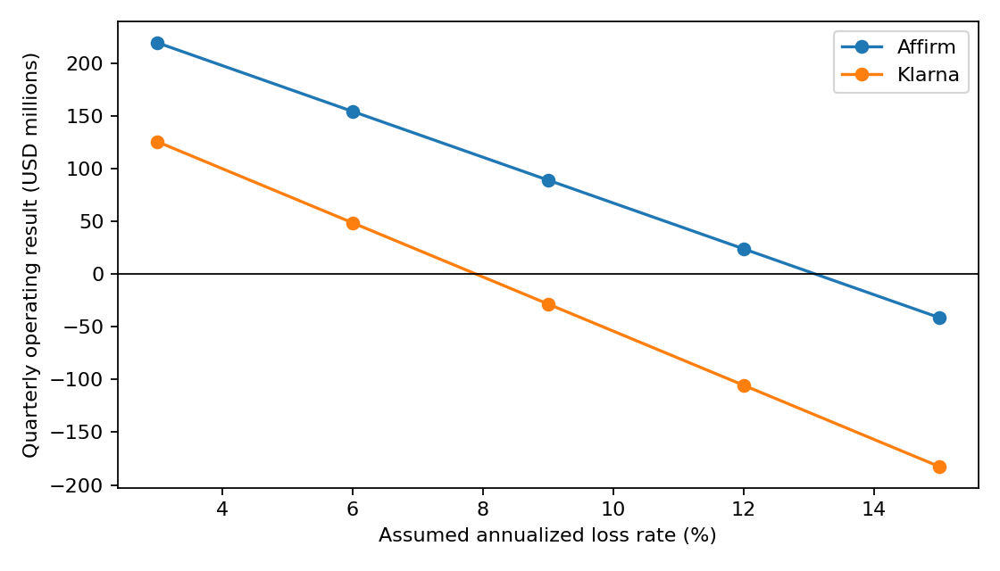
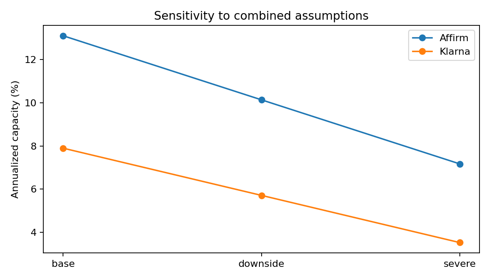

# Affirm vs. Klarna: Credit-Loss Capacity Under Alternative Stress Scenarios

## Research question

How much annualized credit-loss pressure could the current earnings capacity of Affirm and Klarna absorb under clearly defined accounting, exposure, and attribution assumptions?

## Executive summary

Using the latest comparable public quarter available on the August 1, 2026 review date (both ended March 31, 2026), the base company-level accounting scenario produces static annualized credit-loss capacities of **13.1% for Affirm** and **7.9% for Klarna**. Under the combined downside and severe assumptions, the ranges are **10.9%–13.1%** for Affirm and **5.7%–7.9%** for Klarna.

This is not a realized-NCO comparison or a forecast. It is a scenario-based accounting capacity calculation: reported operating income plus recognized provision, divided by aligned average company-level consumer credit exposure. Klarna's disclosed Fair Financing write-offs are retained as source evidence, but the filing does not provide comparable Fair Financing recoveries or a product-level income statement; the project therefore does not manufacture a Fair-Financing NCO or profit result.

## Scope and sources

| Company | Comparable period | Numerator | Average exposure | Basis |
|---|---|---:|---:|---|
| Affirm | Fiscal Q3 2026, ended March 31 | $284.972m pre-credit-loss operating income | $8.700bn LHI | GAAP |
| Klarna | Q1 2026, ended March 31 | $203m pre-credit-loss operating profit | $10.283bn gross consumer receivables | IFRS |

Primary sources are the [Affirm Q3 FY2026 10-Q](https://www.sec.gov/Archives/edgar/data/1820953/000162828026032294/afrm-20260331.htm) and [Klarna Q1 2026 6-K earnings release](https://www.sec.gov/Archives/edgar/data/2003292/000162828026034877/exhibitno992q126earnings.htm), with Klarna exposure detail in its [Q1 interim report](https://www.sec.gov/Archives/edgar/data/2003292/000162828026034877/exhibitno994klarnagroupplc.htm). Every model input is in [data/source_manifest.csv](data/source_manifest.csv), classified as observed, derived, assumed, or unavailable.

## Methodology

`pre_credit_loss_operating_income = operating_income + provision`

`static_annualized_capacity = 4 × pre_credit_loss_operating_income / average_exposure`

Provision is an accounting expense for expected and realized losses; it is never labeled net charge-offs. Affirm directly discloses Q3 gross charge-offs ($179.693m) and recoveries ($21.675m), yielding derived net charge-offs of $158.018m. Klarna discloses $108m of Fair Financing write-offs but not the associated recoveries, so no comparable Klarna NCO is claimed. See [methodology](docs/methodology.md), [assumptions](docs/assumptions.md), and [source notes](docs/source_notes.md).

## Deterministic results

The default grid tests 3%, 6%, 9%, 12%, and 15% assumed annualized loss rates. Base keeps the quarter static; downside and severe reduce revenue and increase funding costs and operating expenses. Outputs are generated, not hand-copied: [outputs/summary.csv](outputs/summary.csv) and [outputs/scenario_results.csv](outputs/scenario_results.csv).







## Interpretation and limitations

The model indicates greater company-level accounting capacity for Affirm under these selected inputs and scenarios. The magnitude is sensitive to the accounting basis, static-quarter annualization, and the fact that company-level earnings can absorb losses from other activities. Product mix may be useful context, but this model does not decompose revenue, funding costs, servicing costs, and credit losses by product and therefore does not establish a causal product-mix mechanism.

Monte Carlo was removed. Seven provision-derived observations and a Klarna proxy distribution could not support a historical probability-of-loss claim. No delinquency-transition model is implemented, so this project does not use “roll rate” terminology.

## Reproduce

```bash
python3 -m pip install -e '.[dev]'
python3 -m src.run --mode deterministic --output-dir outputs
python3 -m pytest -q
ruff check .
```

The command validates the manifest, writes machine-readable tables and figures, prints capacity summaries and unavailable inputs, and fails on incompatible scope, currency, accounting basis, or invalid values.

## Repository structure

```text
config/     transparent stress assumptions
data/       source manifest
docs/       audit, methodology, assumptions, source notes
src/        typed inputs, validation, deterministic model, reporting, plots
tests/      model and validation checks
outputs/    reproducible generated artifacts
```

This is an analytical exercise, not investment advice.
